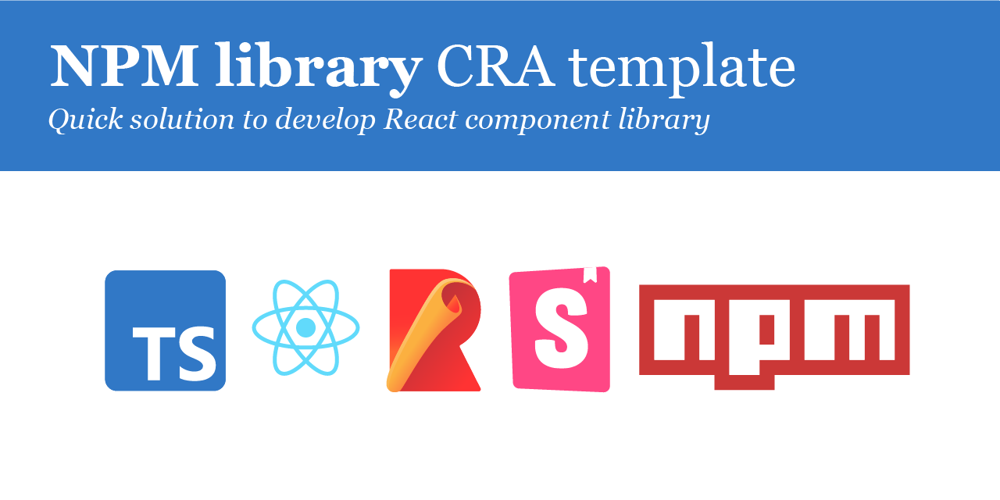

# Deprecation notice

**Create React App is not updated by its maintainers anymore. So this project can't be updated as well. I recommend to use [React Library Template](https://github.com/morewings/react-library-template) which has all the same functionality plus new features.**

# NPM library Create React App template

[](#)


[Create React App](https://github.com/facebook/create-react-app) (CRA) template to build and publish NPM libraries with **rollup**, **eslint** and **stylelint** configurations.

🎁👌🤓 **NEW!** Now with **Typescript** support.

Read [full documentation](https://github.com/morewings/cra-template-npm-library/wiki).

Visit [Demo Storybook](https://morewings.github.io/cra-template-npm-library).

## Features

- Supports **Typescript** and **Javascript**.
- Bundles `commonjs` and `es` module formats.
- [Husky](https://github.com/typicode/husky) for git hooks.
- [Eslint](https://eslint.org/) and [stylelint](https://stylelint.io/).
- [Rollup](https://rollupjs.org/guide/en/) for bundling.
- [Jest](https://jestjs.io/) and [react-testing-library](https://testing-library.com/docs/react-testing-library/intro) for testing.
- Supports CSS modules, SASS/SCSS and PostCSS.
- [Storybook](https://storybook.js.org/) for documentation and demo.
- And [much more](https://github.com/morewings/cra-template-npm-library/wiki).

## Quickstart

```shell script
npx create-react-app %PROJECT_NAME% --template npm-library
yarn create react-app %PROJECT_NAME% --template npm-library
pnpm create react-app %PROJECT_NAME% --template npm-library
```

Then

```shell script
cd %PROJECT_NAME%
npm run prepare
yarn run prepare
pnpm run prepare
```
